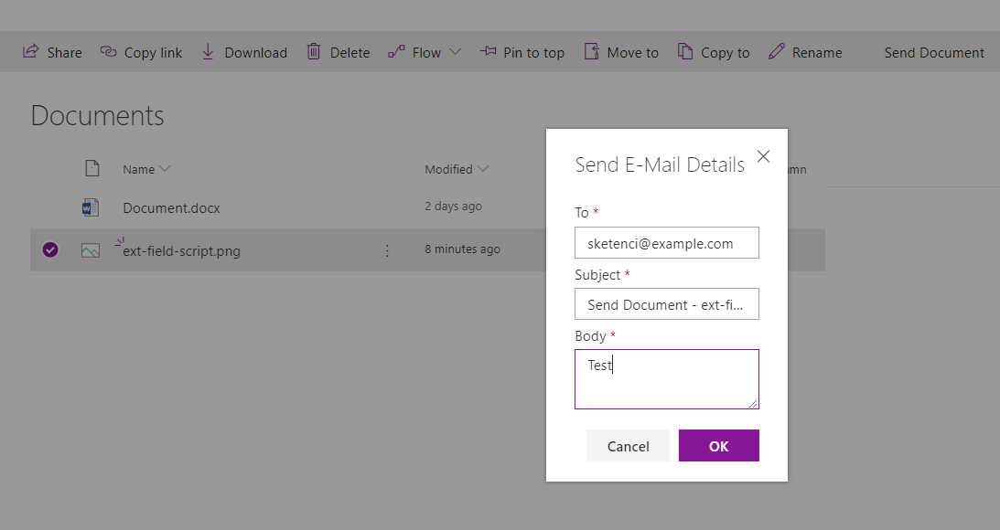

# Send Document With E-Mail

## Summary
This sample shows how to create Custom Dialogs using `@microsoft/sp-dialog` package in the context of Command View Set and send selected document with e-mail.



## Used SharePoint Framework Version 


## Applies to

* [SharePoint Framework](http://dev.office.com/sharepoint/docs/spfx/sharepoint-framework-overview)
* [Office 365 tenant](http://dev.office.com/sharepoint/docs/spfx/set-up-your-developer-tenant)
* [Consume Microsoft Graph](https://docs.microsoft.com/en-us/sharepoint/dev/spfx/use-aad-tutorial)

## Solution

Solution|Author(s)
--------|---------
React-Send-Document | Serdar Ketenci

## Version history

Version|Date|Comments
-------|----|--------
1.0|February 10, 2019|Initial version

## Disclaimer
**THIS CODE IS PROVIDED *AS IS* WITHOUT WARRANTY OF ANY KIND, EITHER EXPRESS OR IMPLIED, INCLUDING ANY IMPLIED WARRANTIES OF FITNESS FOR A PARTICULAR PURPOSE, MERCHANTABILITY, OR NON-INFRINGEMENT.**

---

## Minimal Path to Awesome

- Clone this repository
- Move to folder where this readme exists
- In the command window run:
  - `npm install`
  - `gulp serve --nobrowser`
- Use following query parameter in the SharePoint site to get extension loaded without installing it to app catalog

## Debug URL for testing
Here's a debug URL for testing around this sample. 

```
?loadSpfx=true&debugManifestsFile=https://localhost:4321/temp/manifests.js&customActions={"07836d91-b9e4-4d89-907d-a05c6b6adb6e":{"location":"ClientSideExtension.ListViewCommandSet.CommandBar"}}
```
Full URL to request would be something like following:

```
contoso.sharepoint.com/Lists/Orders/AllItems.aspx?loadSpfx=true&debugManifestsFile=https://localhost:4321/temp/manifests.js&customActions={"07836d91-b9e4-4d89-907d-a05c6b6adb6e":{"location":"ClientSideExtension.ListViewCommandSet.CommandBar"}}
```

## Features
This project contains SharePoint Framework extensions that illustrates next features:
* Command extension
* Custom dialog control using `@microsoft/sp-dialog` package
* using @pnp/sp
* using Microsoft Graph API

> Notice. This sample is designed to be used in debug mode and does not contain automatic packaging setup for the "production" deployment.